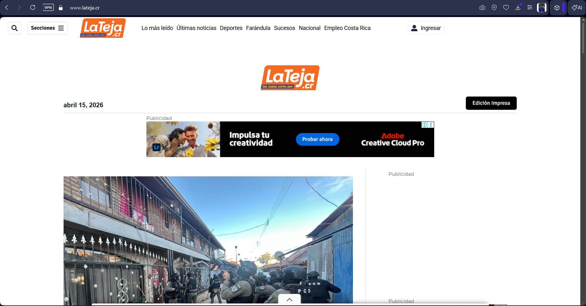
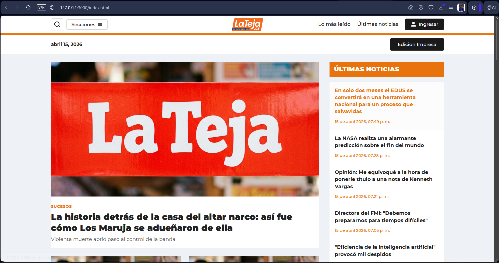

# tarea1-clon-web

## Información general

- **Estudiante:** Maylo Daring Parra Aguirre
- **Curso:** Multimedios
- **Sitio clonado:** [La Teja](https://www.lateja.cr)

## Descripción

Clon de la sección principal del sitio de noticias **La Teja** (Costa Rica), desarrollado como parte de la Tarea 1 del curso. El objetivo fue replicar la estructura y el diseño visual del sitio original utilizando únicamente HTML semántico y CSS puro, sin frameworks ni JavaScript.

## Tecnologías usadas

### HTML
- Estructura completa con `<!DOCTYPE html>`, `<head>` y `<body>`
- Etiquetas semánticas: `<header>`, `<nav>`, `<main>`, `<section>`, `<article>`, `<aside>`, `<footer>`
- Etiquetas `` con atributo `alt` descriptivo en cada imagen (logo, noticias, hero)
- Formulario de contacto con 4 campos: `<input>` texto, `<input>` email, `<select>` y `<textarea>`

### CSS
- Archivo externo separado (`index.css`), sin usar `style=""` ni `<style>` en el HTML
- 3 tipos de selectores: de elemento (`body`, `a`, `img`), de clase (`.container`, `.hero-link`), pseudo-selectores (`:hover`, `:focus`, `:last-child`, `::placeholder`)
- Tipografía Roboto importada desde Google Fonts
- Paleta de colores con variables CSS: `--color-primario`, `--color-secundario`, `--color-acento`, entre otras
- Layouts con CSS Grid (layout principal, grids de noticias, footer) y Flexbox (header, formulario, iconos sociales)
- Diseño responsive con 4 media queries (1024px, 900px, 768px, 480px)
- Comentario en el CSS explicando una decisión de especificidad y cómo actúa la cascada

## Comparativa visual

### Screenshot del original


- Está es la imagen de la pagina original

### Screenshot del resultado

- Se puede ver que el clon es algo similar al original en cuanto a estructura y diseño solo que se cambió un poco por error en el posicionamiento de etiquetas.

## Estructura del proyecto

```
tarea1-clon-web/
├── index.html        # Página principal
├── index.css         # Hoja de estilos
├── img/
│   ├── logo-web.svg  # Logo de La Teja
│   ├── imagen1.jpg   # Imagen placeholder
│   └── screenshot-original.png # Screenshot del sitio original
│   └── screenshot-resultado.png # Screenshot del clon
└── README.md
```

